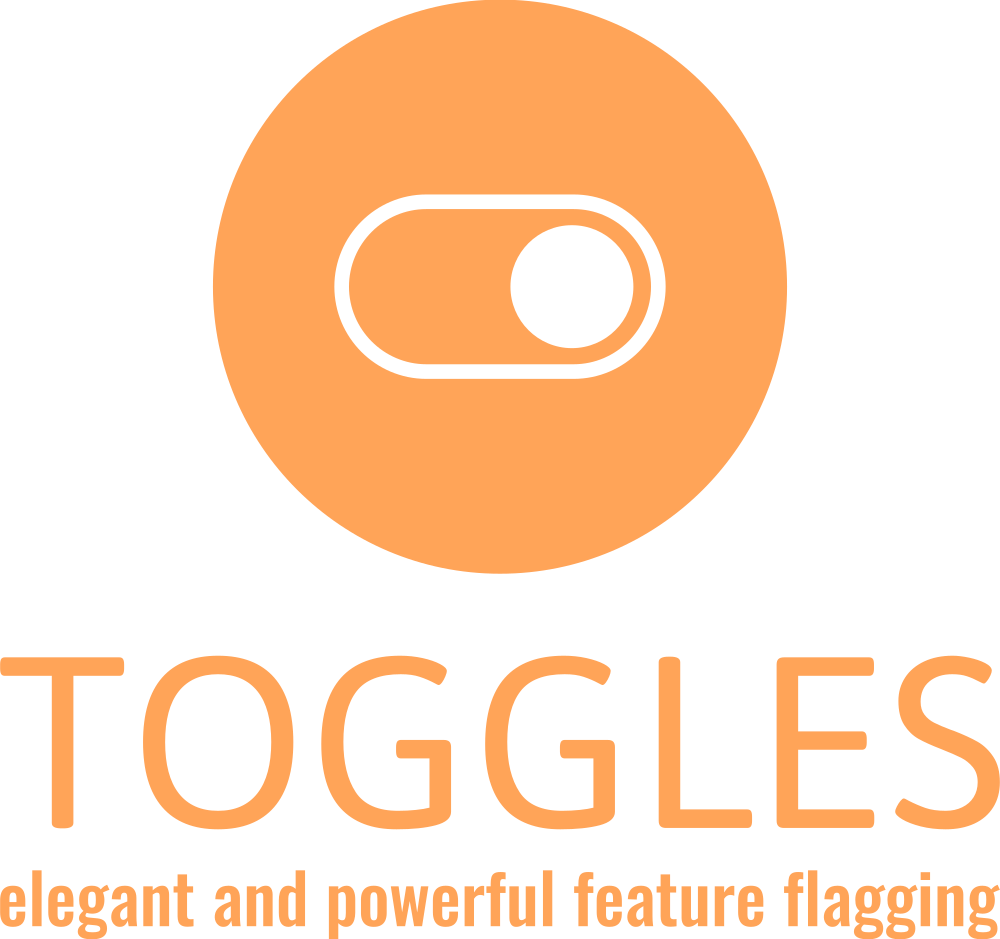

<p align="center">

</p>

## Toggles

Toggles is an elegant and powerful solution to feature flagging for Apple platforms.

[](https://swiftpackageindex.com/TogglesPlatform/Toggles)
[](https://swiftpackageindex.com/TogglesPlatform/Toggles)


## Overview

Feature flags (or feature toggles) are an important capability in modern applications. They allow apps to support different code paths and multiple features. Remote configuration of feature flags is what enables changing the behaviour of apps and the enabling/disabling of features without the need for expensive releases.
Feature flags are at the core of A/B testing and experimentation.

## Usage

Here is a quick and basic usage example.

Define a local datasource with your base configuration in `DefaultDatasource.json`.


```json
{
  "toggles": [
    {
      "variable": "enable_feature_x",
      "bool": true
    },
    {
      "variable": "retry_count",
      "int": 3
    },
    {
      "variable": "welcome_text",
      "string": "Greetings!"
    }
    ...
}
```

Allocate a manager to interface with the configuration.

```swift
let datasourceUrl = Bundle.main.url(forResource: "DefaultDatasource", withExtension: "json")!
try ToggleManager(valueProviders: [], datasourceUrl: datasourceUrl)
```

Optionally set a mutable value provider and multiple value providers needed for your use case: 

```swift
let mutableValueProvider = PersistentValueProvider(userDefaults: .standard)
let remoteValueProvider = SomeRemoteValueProvider(...)
let localValueProvider = try LocalValueProvider(jsonUrl: secondaryDatasourceUrl)
let valueProviders = [remoteValueProvider, localValueProvider]
try ToggleManager(mutableValueProvider: mutableValueProvider,
                  valueProviders: valueProviders,
                  datasourceUrl: datasourceUrl)
```

Retrieve values like so:

```swift
let shouldEnableFeatureX = manager.value(for: "enable_feature_x").boolValue
let welcomeText = manager.value(for: "welcome_text").stringValue
```

There's a lot more to it: from code generation to observing toggle value changes.

Please refer to the [DocC documentation](https://togglesplatform.github.io/Toggles/documentation/toggles/) and articles provided for more information.

## Demo app

A demo app showcasing all the features is available. We encourage the reader to play with it. 


## License

Toggles is released under the Apache 2 license. See [LICENSE](LICENSE) for details.
